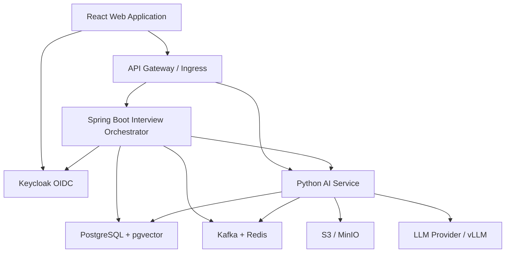
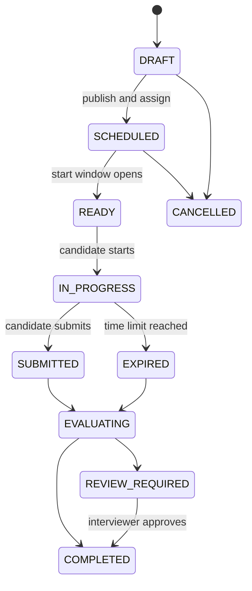
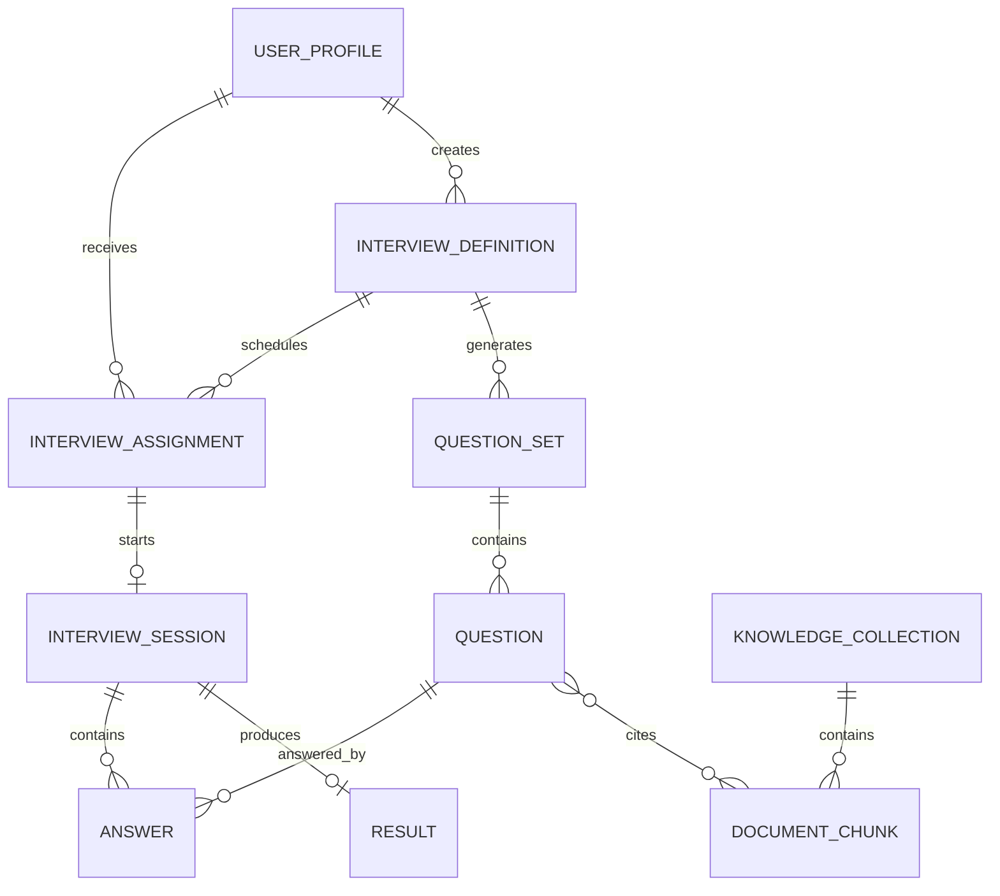
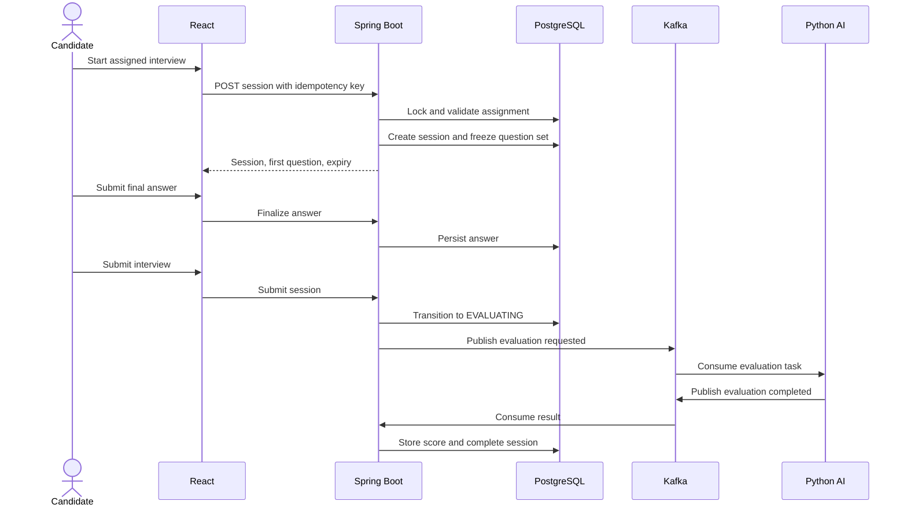
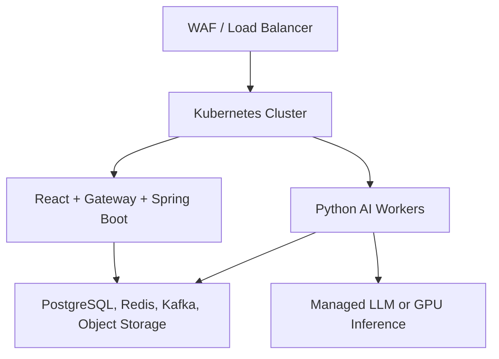

# Online Interview Platform — HLD and LLD

## 1. Purpose

Online Interview is a web platform for scheduling and conducting AI-assisted technical interviews in the Java and AI ecosystems.

It supports two primary users:

- **Interviewer** — creates interview templates, selects skills and difficulty, schedules interviews, assigns candidates, and reviews results.
- **Candidate** — registers, views upcoming interviews, starts an assigned interview during the allowed window, answers questions, and reviews permitted results.

Questions can be delivered in two modes:

1. **Direct LLM mode** — the Python AI service generates questions from structured instructions.
2. **RAG mode** — the AI service retrieves approved content from a knowledge base and generates grounded questions with source references.

## 2. Scope and assumptions

### MVP scope

- Candidate and interviewer registration/login
- Role-based dashboards
- Interview creation, assignment, scheduling, and lifecycle management
- Java and AI skill selection
- Direct LLM and RAG question generation
- Text-based interview experience
- Objective and AI-assisted evaluation
- Interview results and audit history
- Email/in-app notifications
- Docker-based local environment and Kubernetes-ready deployment

### Later phases

- Live video/audio interviews
- Speech-to-text and text-to-speech
- Collaborative coding editor and code execution sandbox
- Human interviewer joining an active session
- Proctoring and identity verification
- Organization/tenant administration
- Subscription and billing

## 3. Recommended technology stack

| Layer | Technology | Responsibility |
|---|---|---|
| Web UI | React, TypeScript, Vite, React Router, TanStack Query | Login, dashboards, interview experience |
| API entry | Spring Cloud Gateway or ingress gateway | Routing, throttling, cross-cutting controls |
| Business orchestrator | Java 21+, Spring Boot 3.x | Users, schedules, sessions, workflow, authorization |
| Authentication | Keycloak using OAuth 2.1/OIDC | Login, registration, MFA-ready identity |
| AI service | Python 3.12+, FastAPI, LangGraph/LangChain | Direct generation, RAG, evaluation |
| Primary database | PostgreSQL | Transactional platform data |
| Vector store | pgvector initially | Document chunks and embeddings |
| Cache/state | Redis | Session cache, locks, rate limits, short-lived state |
| Messaging | Kafka | Asynchronous generation, evaluation, notifications, audit events |
| Object storage | S3/MinIO | Resumes, source documents, reports, recordings later |
| LLM providers | OpenAI/Azure OpenAI or local vLLM/Ollama | Model inference via provider abstraction |
| Observability | OpenTelemetry, Prometheus, Grafana, Loki/ELK | Metrics, traces, logs |
| Deployment | Docker Compose locally; Kubernetes in production | Runtime platform |

## 4. High-level architecture



### Architectural boundary

Spring Boot is the **system of record and workflow orchestrator**. It owns authorization, interview definitions, assignments, schedules, session state, and final results.

Python is a specialized **AI capability service**. It does not decide whether a candidate is allowed to start an interview. Spring Boot validates the request and sends a narrow, versioned AI task to Python.

The browser should call Spring Boot for business workflows. Streaming AI responses may be proxied through Spring Boot or exposed through a gateway-protected AI streaming endpoint using a short-lived session token.

## 5. Major components

### React application

Recommended feature modules:

- `auth` — login, registration, logout, callback
- `candidate-dashboard` — upcoming, active, completed interviews
- `interviewer-dashboard` — templates, schedules, candidates, results
- `interview-builder` — skills, difficulty, question mode, duration
- `interview-session` — question, timer, answer editor, navigation
- `results` — score breakdown and feedback
- `admin` — optional future tenant/user management
- `shared` — API client, components, validation, auth utilities

Use an OIDC Authorization Code flow with PKCE. Prefer a backend-for-frontend/HttpOnly-cookie pattern for production; do not store long-lived tokens in local storage.

### Spring Boot orchestrator

Recommended bounded modules:

- Identity profile and role mapping
- Candidate management
- Interview template management
- Interview scheduling and assignment
- Interview session state machine
- Question orchestration
- Answer submission
- Evaluation orchestration
- Result aggregation
- Notification coordination
- Audit logging

Start as a **modular monolith**. The modules can later be extracted into services when scaling or team ownership justifies it.

### Python AI service

Recommended modules:

- Prompt template registry
- LLM provider abstraction
- Direct question generator
- RAG ingestion pipeline
- Retriever and reranker
- Grounded question generator
- Answer evaluator
- Safety and output validation
- Token/cost telemetry
- Model/prompt version registry

All AI outputs must follow JSON schemas. Validate them before returning them to Spring Boot.

## 6. Core user journeys

### Interviewer journey

1. Interviewer logs in.
2. Creates an interview template.
3. Selects Java/AI topics, difficulty, number of questions, duration, and generation mode.
4. Optionally selects a RAG knowledge collection.
5. Assigns one or more candidates and selects a time window.
6. Spring Boot validates and stores the schedule.
7. Question sets are generated in advance, or generated just in time according to policy.
8. Candidate is notified.
9. Interviewer reviews completion, scores, answers, citations, and AI feedback.

### Candidate journey

1. Candidate registers and verifies identity.
2. Candidate logs in and sees upcoming interviews.
3. Candidate selects an interview.
4. Spring Boot checks assignment, time window, attempt status, and concurrency rules.
5. Candidate starts the session.
6. Questions are presented one at a time; answers are autosaved.
7. Candidate submits or the timer expires.
8. Evaluation runs asynchronously.
9. The dashboard shows status and permitted feedback.

## 7. Interview state model



State transitions must be performed atomically by Spring Boot. Use optimistic locking on interview sessions and an idempotency key on start/submit operations.

## 8. Question-generation strategies

### Direct LLM mode

Spring Boot sends a structured request containing:

- interview ID and immutable generation request ID
- skill taxonomy, for example Java concurrency, Spring Security, RAG
- seniority and difficulty
- question type and count
- expected duration
- exclusions and previously used question fingerprints
- prompt/model policy identifier

The Python service returns validated question objects with expected answer criteria and scoring rubrics.

### RAG mode

1. Interviewer uploads or selects approved source documents.
2. The ingestion pipeline extracts text, removes unsafe content, chunks it, creates embeddings, and stores metadata.
3. At generation time, retrieval is filtered by tenant, collection, document status, and topic.
4. A reranker selects the strongest evidence.
5. The LLM generates questions only from the retrieved context.
6. Each question stores citations to source chunks.
7. A grounding check rejects or retries unsupported questions.

RAG data must be isolated by organization/tenant. User-uploaded document text must never be inserted into a system prompt without prompt-injection defenses and strict context delimiters.

## 9. Logical data model



### Key tables

#### user_profile

| Column | Type | Notes |
|---|---|---|
| id | UUID | Internal identifier |
| identity_subject | VARCHAR | Keycloak `sub`, unique |
| email | VARCHAR | Unique within tenant |
| display_name | VARCHAR | Candidate/interviewer name |
| role | ENUM | CANDIDATE, INTERVIEWER |
| tenant_id | UUID | Required for isolation |
| status | ENUM | ACTIVE, SUSPENDED |
| created_at | TIMESTAMP | Audit field |

#### interview_definition

| Column | Type | Notes |
|---|---|---|
| id | UUID | Interview template ID |
| owner_id | UUID | Interviewer |
| title | VARCHAR | Display title |
| description | TEXT | Instructions |
| generation_mode | ENUM | DIRECT_LLM, RAG, MANUAL, HYBRID |
| difficulty | ENUM | EASY, MEDIUM, HARD, MIXED |
| duration_minutes | INT | Positive limit |
| question_count | INT | Validated limit |
| skills | JSONB | Versioned skill selection |
| knowledge_collection_id | UUID | Nullable |
| status | ENUM | DRAFT, PUBLISHED, ARCHIVED |
| version | INT | Optimistic locking |

#### interview_assignment

| Column | Type | Notes |
|---|---|---|
| id | UUID | Assignment ID |
| interview_definition_id | UUID | Template |
| candidate_id | UUID | Assigned candidate |
| starts_at | TIMESTAMP | UTC |
| ends_at | TIMESTAMP | UTC |
| max_attempts | INT | Normally 1 |
| status | ENUM | SCHEDULED, CANCELLED, COMPLETED |
| access_policy | JSONB | Optional rules |

#### interview_session

| Column | Type | Notes |
|---|---|---|
| id | UUID | Session ID |
| assignment_id | UUID | Unique per attempt |
| question_set_id | UUID | Frozen question set |
| state | ENUM | Lifecycle state |
| started_at | TIMESTAMP | Server time |
| submitted_at | TIMESTAMP | Nullable |
| expires_at | TIMESTAMP | Server-calculated |
| current_question_index | INT | Resume support |
| version | INT | Optimistic lock |

#### question and answer

A question stores type, prompt, topic, difficulty, rubric, maximum score, generation metadata, model version, prompt version, and citations. An answer stores autosaved content, final content, timestamps, score, evaluator feedback, evaluator version, and review state.

## 10. REST API design

Base path: `/api/v1`

### Authentication/profile

| Method | Endpoint | Role | Purpose |
|---|---|---|---|
| GET | `/me` | Authenticated | Current profile and permissions |
| POST | `/profiles/registration-complete` | Authenticated | Complete application profile |

Registration and login are initiated through Keycloak/OIDC rather than custom password APIs.

### Interviewer APIs

| Method | Endpoint | Purpose |
|---|---|---|
| POST | `/interviews` | Create draft definition |
| GET | `/interviews` | List owned interviews |
| GET | `/interviews/{id}` | Get definition |
| PUT | `/interviews/{id}` | Update draft |
| POST | `/interviews/{id}/publish` | Publish definition |
| POST | `/interviews/{id}/assignments` | Assign and schedule candidates |
| POST | `/interviews/{id}/question-sets:generate` | Request question generation |
| GET | `/interviews/{id}/results` | View results |

### Candidate APIs

| Method | Endpoint | Purpose |
|---|---|---|
| GET | `/candidate/interviews?status=upcoming` | Dashboard list |
| GET | `/candidate/interviews/{assignmentId}` | Assignment details |
| POST | `/candidate/interviews/{assignmentId}/sessions` | Start/resume attempt |
| GET | `/sessions/{sessionId}/questions/current` | Current question |
| PUT | `/sessions/{sessionId}/answers/{questionId}` | Idempotent autosave |
| POST | `/sessions/{sessionId}/answers/{questionId}:finalize` | Finalize answer |
| POST | `/sessions/{sessionId}:submit` | Submit interview |
| GET | `/candidate/results/{sessionId}` | Permitted result view |

### Knowledge APIs

| Method | Endpoint | Purpose |
|---|---|---|
| POST | `/knowledge/collections` | Create collection |
| POST | `/knowledge/collections/{id}/documents` | Request upload |
| POST | `/knowledge/documents/{id}:ingest` | Trigger ingestion |
| GET | `/knowledge/documents/{id}/status` | View ingestion status |

Use `Idempotency-Key` for create/start/submit/generate calls. Return RFC 9457 Problem Details for errors.

## 11. Internal AI contracts

### Generate questions request

```json
{
  "requestId": "uuid",
  "interviewId": "uuid",
  "mode": "RAG",
  "skills": [
    {"name": "Java Concurrency", "weight": 60},
    {"name": "RAG Architecture", "weight": 40}
  ],
  "difficulty": "HARD",
  "questionCount": 5,
  "candidateSeniorityYears": 12,
  "knowledgeCollectionId": "uuid",
  "modelPolicy": "interview-question-v1"
}
```

### Generate questions response

```json
{
  "requestId": "uuid",
  "questionSetVersion": 1,
  "questions": [
    {
      "externalId": "q-1",
      "type": "DESCRIPTIVE",
      "topic": "Java Concurrency",
      "difficulty": "HARD",
      "prompt": "Design a bounded concurrent processing pipeline.",
      "rubric": [
        {"criterion": "Backpressure", "weight": 30},
        {"criterion": "Failure handling", "weight": 30},
        {"criterion": "Thread safety", "weight": 40}
      ],
      "citations": []
    }
  ],
  "model": "configured-provider-model",
  "promptVersion": "interview-question-v1"
}
```

Never expose the rubric or expected answer to the candidate UI.

## 12. Detailed session sequence



## 13. Spring Boot package design

```text
online-interview-orchestrator/
├── src/main/java/com/onlineinterview/
│   ├── OnlineInterviewApplication.java
│   ├── shared/
│   │   ├── security/
│   │   ├── error/
│   │   ├── audit/
│   │   └── events/
│   ├── profile/
│   │   ├── api/
│   │   ├── application/
│   │   ├── domain/
│   │   └── infrastructure/
│   ├── interview/
│   │   ├── api/
│   │   ├── application/
│   │   ├── domain/
│   │   └── infrastructure/
│   ├── session/
│   │   ├── api/
│   │   ├── application/
│   │   ├── domain/
│   │   └── infrastructure/
│   ├── evaluation/
│   ├── knowledge/
│   └── notification/
└── src/test/
```

Use ports and adapters inside each business module:

- `api` — REST controllers and request/response DTOs
- `application` — use cases and transaction boundaries
- `domain` — aggregates, value objects, policies, domain events
- `infrastructure` — JPA, Kafka, HTTP clients, object storage adapters

Key domain services:

- `ScheduleInterviewUseCase`
- `StartInterviewSessionUseCase`
- `SaveAnswerUseCase`
- `SubmitInterviewUseCase`
- `GenerateQuestionSetUseCase`
- `CompleteEvaluationUseCase`

## 14. Python AI service package design

```text
ai-service/
├── app/
│   ├── main.py
│   ├── api/
│   │   ├── question_routes.py
│   │   ├── evaluation_routes.py
│   │   └── ingestion_routes.py
│   ├── application/
│   │   ├── generate_questions.py
│   │   ├── evaluate_answer.py
│   │   └── ingest_document.py
│   ├── domain/
│   │   ├── models.py
│   │   ├── schemas.py
│   │   └── policies.py
│   ├── llm/
│   │   ├── provider.py
│   │   ├── prompts/
│   │   └── structured_output.py
│   ├── rag/
│   │   ├── loaders.py
│   │   ├── chunking.py
│   │   ├── embeddings.py
│   │   ├── retrieval.py
│   │   └── grounding.py
│   ├── messaging/
│   └── observability/
└── tests/
    ├── unit/
    ├── integration/
    └── evaluation/
```

The `LLMProvider` interface should isolate model vendors. Prompt templates and response schemas must be version controlled. Maintain a small evaluation dataset to detect quality regressions before prompt/model changes are promoted.

## 15. React package design

```text
web-ui/
├── src/
│   ├── app/
│   │   ├── router.tsx
│   │   ├── providers.tsx
│   │   └── auth-guard.tsx
│   ├── features/
│   │   ├── auth/
│   │   ├── candidate-dashboard/
│   │   ├── interviewer-dashboard/
│   │   ├── interview-builder/
│   │   ├── interview-session/
│   │   ├── knowledge-base/
│   │   └── results/
│   ├── shared/
│   │   ├── api/
│   │   ├── components/
│   │   ├── hooks/
│   │   ├── types/
│   │   └── validation/
│   └── main.tsx
└── tests/
```

Candidate routes:

- `/candidate/dashboard`
- `/candidate/interviews/:assignmentId`
- `/candidate/sessions/:sessionId`
- `/candidate/results/:sessionId`

Interviewer routes:

- `/interviewer/dashboard`
- `/interviewer/interviews/new`
- `/interviewer/interviews/:id/edit`
- `/interviewer/interviews/:id/assign`
- `/interviewer/interviews/:id/results`

## 16. Security design

- Use Keycloak realms/clients and OIDC Authorization Code with PKCE.
- Enforce roles and ownership in Spring Boot using method-level authorization and domain policies.
- Treat gateway token checks as the first layer; Spring Boot must also validate the token and authorization.
- Keep browser sessions in Secure, HttpOnly, SameSite cookies when using a BFF.
- Apply tenant filters at every repository boundary.
- Encrypt data in transit and at rest; use a secrets manager for credentials and keys.
- Never place personally identifiable information in prompts unless explicitly required and approved.
- Redact sensitive data from logs and traces.
- Use signed, short-lived object-storage upload/download URLs.
- Validate file type, size, malware status, and extraction limits.
- Protect AI calls against prompt injection, data exfiltration, oversized context, and unsafe output.
- Persist immutable audit events for schedule changes, interview starts, answer finalization, submission, evaluation, and manual score overrides.
- Do not send hidden rubrics, expected answers, or other candidates' data to the browser.
- Add rate limits and anomaly detection to start, answer, upload, and AI endpoints.

## 17. Reliability and consistency

- PostgreSQL remains authoritative for interview/session state.
- Use the transactional outbox pattern when publishing Kafka events.
- Consumers must be idempotent using event ID and aggregate version.
- Autosave endpoints use optimistic versioning and return the accepted server version.
- The server owns the timer; the UI timer is only a visual projection.
- Freeze question content and rubric when a session starts.
- Retry transient AI failures with bounded exponential backoff.
- Send unrecoverable tasks to a dead-letter topic and mark them for operations review.
- If AI generation fails before an interview, prevent start unless an approved fallback question set exists.
- Evaluation failure must not lose candidate answers; show `EVALUATION_PENDING`.

## 18. Observability

Every request/event should carry:

- correlation ID
- trace ID
- tenant ID
- interview/session ID where applicable
- AI request ID
- model and prompt version (AI telemetry only)

Key metrics:

- start-session success/failure
- answer autosave latency and error rate
- active sessions
- evaluation queue lag
- generation/evaluation latency
- token usage and estimated cost
- retrieval precision indicators and grounding failure rate
- completion and abandonment rate

## 19. Deployment view



Run web/API workloads and AI workers with separate scaling policies. Scale Spring Boot using CPU/request latency; scale AI workers using Kafka lag, concurrent inference requests, and provider limits.

## 20. Proposed monorepo

```text
Java_AI_MCP/
├── README.md
├── docs/
│   ├── architecture-design.md
│   ├── api/
│   └── adr/
├── apps/
│   ├── web-ui/
│   ├── interview-orchestrator/
│   └── ai-service/
├── platform/
│   ├── docker/
│   ├── kubernetes/
│   ├── terraform/
│   └── observability/
├── contracts/
│   ├── openapi/
│   ├── asyncapi/
│   └── json-schema/
└── scripts/
```

A monorepo is appropriate for the initial team because API contracts and end-to-end changes can be versioned together. Independent CI workflows should still build and deploy each application separately.

## 21. Testing strategy

- **React:** component tests, route/permission tests, Playwright end-to-end tests
- **Spring Boot:** domain unit tests, Spring slice tests, Testcontainers integration tests, authorization tests
- **Python:** unit tests, provider contract tests, RAG retrieval tests, structured-output tests
- **AI quality:** golden question/evaluation datasets, groundedness checks, bias/safety checks
- **Contracts:** OpenAPI/AsyncAPI validation and consumer-driven contract tests
- **Resilience:** duplicate events, Kafka outage, LLM timeout, expired session, concurrent submit
- **Security:** IDOR/BOLA, role escalation, tenant isolation, malicious document/prompt injection

## 22. Delivery phases

### Phase 1 — Foundation

- Monorepo skeleton and CI
- Keycloak login/registration
- React role-based shell
- Spring Boot profile and authorization modules
- PostgreSQL schema and audit foundation

### Phase 2 — Interview workflow

- Interview definition and scheduling
- Candidate upcoming-interview dashboard
- Session state machine, timer, question navigation, autosave
- Manual question sets for deterministic end-to-end validation

### Phase 3 — AI generation

- Python FastAPI service
- Direct LLM question generation
- Structured output and prompt/model versioning
- Kafka-based asynchronous evaluation

### Phase 4 — RAG

- Document upload and ingestion
- pgvector retrieval and reranking
- Grounded question generation with citations
- Retrieval and grounding evaluation suite

### Phase 5 — Production hardening

- Outbox/idempotency
- Observability dashboards and alerts
- Security testing and tenant isolation
- Kubernetes, autoscaling, backup, recovery, and cost controls

## 23. Architecture decisions

1. **Spring Boot owns workflows; Python owns AI capabilities.**
2. **Start with a modular monolith plus a separately deployable AI service.**
3. **Use Keycloak instead of implementing password authentication.**
4. **Use PostgreSQL with pgvector initially to reduce operational complexity.**
5. **Generate question sets before start where possible to protect interview availability.**
6. **Use asynchronous evaluation so submission remains reliable during LLM latency.**
7. **Version prompts, models, rubrics, question sets, and AI contracts for auditability.**
8. **Adopt Kafka only for durable asynchronous workflows; use synchronous REST for immediate commands.**

## 24. Definition of MVP success

The MVP is complete when an interviewer can create and schedule an interview, a registered candidate can see and complete it within the allowed window, questions can be generated directly by an LLM or from a selected RAG collection, answers survive failures and retries, evaluation produces an auditable result, and each user sees only data permitted by their role and tenant.
