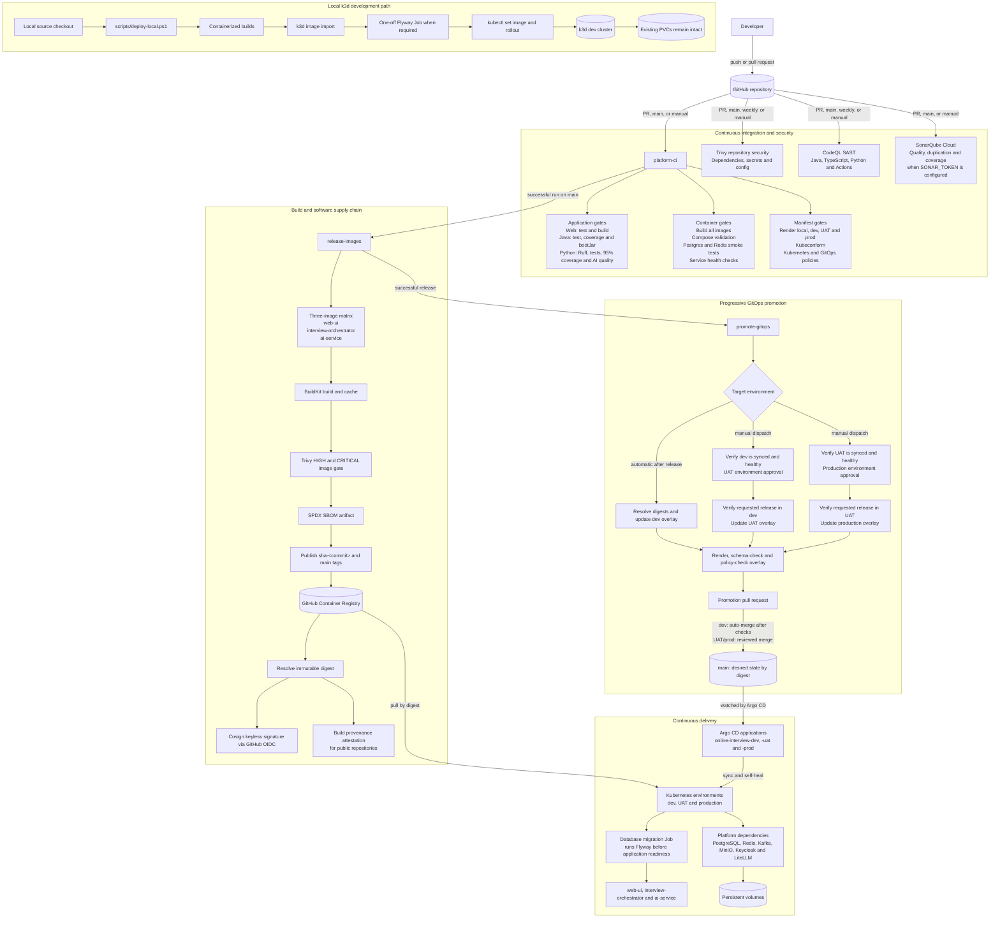

# CI/CD pipeline architecture

This platform uses GitHub Actions for continuous integration and release automation, GitHub Container Registry (GHCR) for image distribution, Git pull requests for environment promotion, and Argo CD for declarative delivery to Kubernetes. Application images move through the pipeline by immutable digest; environment overlays are the deployment source of truth.

## Pipeline behavior

1. Pull requests run application, container, manifest, repository-security, and static-analysis checks. SonarQube Cloud runs only when `SONAR_TOKEN` is configured.
2. A successful `platform-ci` run on `main` starts `release-images`. Digest-only GitOps commits are detected and skipped to prevent a release loop.
3. Each application image is vulnerability-scanned, accompanied by an SPDX SBOM, published to GHCR, resolved to an immutable digest, and signed with Cosign. Public repositories also receive GitHub build-provenance attestations.
4. A successful release automatically targets dev. UAT and production promotions are manually dispatched and require the preceding environment to be healthy in Argo CD.
5. Promotion changes only the target Kustomize overlay, validates the rendered manifests, and opens a pull request. Dev promotions enable automatic merge after required checks; UAT and production remain review- and environment-approval-gated.
6. Argo CD continuously reconciles merged desired state into each Kubernetes environment. The database migration Job advances the schema before application pods become ready.

## Sources of truth

| Concern | Repository location |
|---|---|
| CI tests and build gates | `.github/workflows/ci.yml` |
| Repository and configuration scanning | `.github/workflows/security.yml` |
| Static application security testing | `.github/workflows/codeql.yml` |
| Code quality analysis | `.github/workflows/sonarcloud.yml` |
| Image publishing, SBOMs, signing and attestations | `.github/workflows/release-images.yml` |
| Progressive environment promotion | `.github/workflows/promote-gitops.yml` |
| Kubernetes desired state | `platform/kubernetes/overlays/{dev,uat,prod}` |
| Argo CD applications and project | `platform/gitops/argocd` |
| Local k3d deployment | `scripts/deploy-local.ps1` |

The operational commands, migration procedure, rollback guidance, and local Argo CD setup are documented in [`docs/runbooks/deployment.md`](../runbooks/deployment.md).
