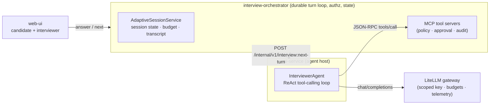
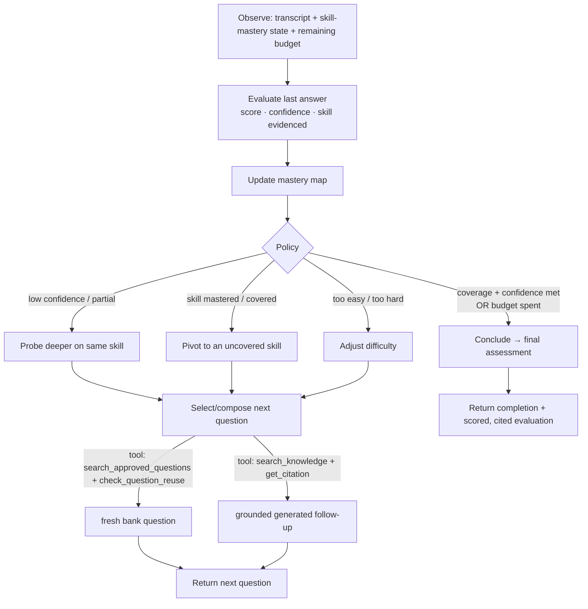
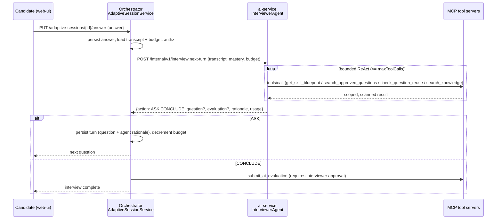

# Design: Adaptive AI Interviewer

**Status:** Draft for review · **Author:** Platform team · **Scope:** new agentic feature

An autonomous agent that **conducts a live, adaptive interview** — choosing or generating each
next question from how the candidate is actually performing, instead of serving a fixed,
pre-generated list. It is the platform's first *pure agentic* capability: it **plans, calls tools,
observes results, adapts, and decides when to stop**, all on the governance rails the MCP layer
already provides.

---

## 1. Goals / Non-goals

**Goals**
- Conduct an interview that adapts difficulty, depth, and skill coverage per answer.
- Reuse the existing platform primitives: session model, MCP tool gateway, LiteLLM gateway,
  approval/policy/audit governance.
- Keep every state-changing action human-approvable and fully audited.
- Be **bounded and durable**: hard turn/time/token budgets; resumable across HTTP turns.

**Non-goals**
- Not autonomous hiring decisions — the agent *proposes* a scored evaluation; a human finalizes it
  through the existing review + MCP approval flow.
- Not a replacement for the existing DIRECT_LLM / RAG fixed-question modes — this is a new
  `ADAPTIVE` interview mode alongside them.
- No new external MCP servers in v1 (internal tools only).

---

## 2. High-Level Design (HLD)

### 2.1 Where it fits

Three tiers already exist and are reused as-is:

- **web-ui (React)** — candidate answers one question at a time; interviewer reviews/approves.
- **interview-orchestrator (Spring Boot)** — system of record: session state, authorization,
  the MCP tool servers, approval/policy/audit. Owns the *durable* turn loop.
- **ai-service (FastAPI)** — the AI/MCP **host**: runs the agent's reasoning + tool-calling loop
  through the LiteLLM gateway.



### 2.2 The agentic model — two nested loops

The feature is agentic at **two levels**:

- **Outer loop (across turns, durable):** one turn per candidate answer. The orchestrator persists
  state between turns, so the interview is resumable and every turn is authorized independently.
  The "wait for human input" boundary is an HTTP turn — which is exactly how a real interview works.
- **Inner loop (within a turn, the agent):** for a single "decide the next move," the
  `InterviewerAgent` runs a bounded **ReAct-style tool-calling loop**: reason → call MCP tool →
  observe → iterate → emit a structured decision. This is the pure-agent core.



### 2.3 Candidate turn — sequence



### 2.4 MCP tool surface

| Tool | Server | Status | Used for |
|---|---|---|---|
| `get_interview_context` | interview | ✅ exists | definition, skills, constraints |
| `get_skill_blueprint` | interview | 🆕 **new** | the rubric/weighting the agent assesses against |
| `search_approved_questions` | question-bank | ✅ exists | pick a vetted next question |
| `check_question_reuse` | question-bank | 🆕 **new** | never repeat a question already asked |
| `search_knowledge` | knowledge | ✅ exists | ground a generated follow-up |
| `get_citation` | knowledge | 🆕 **new** | attach a source to grounded follow-ups/scoring |
| `submit_ai_evaluation` | result | ✅ exists | record the final proposed evaluation (approval-gated) |

The 3 new tools are exactly the "missing" second-tool-per-server gap in the architecture spec — this
feature is their first consumer.

### 2.5 Governance & guardrails (reuse existing)

- **Bounded:** `maxTurns`, wall-clock deadline (session `expiresAt`), per-turn `maxToolCalls`, and the
  LiteLLM token/cost budget. Agents must terminate.
- **Tool allow-list:** `McpPolicyService` restricts the agent to the tools above; every call carries
  a short-lived scoped `McpAuthorizationContext` (service, tenant, actor, session, trace).
- **Human-in-the-loop:** the only state-changing tool, `submit_ai_evaluation`, routes through
  `McpApprovalService` — the interviewer approves the final result. The agent never finalizes hiring.
- **Untrusted input:** candidate answers and tool results are treated as untrusted; `McpResultScanner`
  size-limits/policy-checks results before they enter the LLM context (prompt-injection defense).
- **Audit:** every tool call and agent decision is recorded (`McpToolAuditEvent`) with a rationale.

---

## 3. Low-Level Design (LLD)

### 3.1 Data model

New/extended persistence in the orchestrator (Flyway migration `V26__adaptive_session_state.sql`):

```mermaid
erDiagram
  INTERVIEW_SESSION ||--o| ADAPTIVE_SESSION_STATE : "1:1 when mode=ADAPTIVE"
  ADAPTIVE_SESSION_STATE ||--o{ ADAPTIVE_TURN : has
  ADAPTIVE_SESSION_STATE {
    uuid session_id PK_FK
    int  turns_used
    int  max_turns
    jsonb skill_mastery   "skill -> {confidence, evidenceCount}"
    int  tokens_used
    int  token_budget
    string phase          "RUNNING | CONCLUDING | DONE"
  }
  ADAPTIVE_TURN {
    uuid id PK
    uuid session_id FK
    int  ordinal
    uuid question_id      "nullable (generated)"
    string question_text
    string skill
    string difficulty
    string source         "BANK | GENERATED"
    string answer_text
    int    score
    int    confidence
    string agent_rationale
    jsonb  citations
  }
```

- `interview_definition.question_mode` gains a value **`ADAPTIVE`** (alongside `DIRECT_LLM`, `RAG`).
- `InterviewSession` is reused for lifecycle (`IN_PROGRESS → SUBMITTED`); adaptive-only running
  state lives in `ADAPTIVE_SESSION_STATE` to avoid bloating the core entity.

### 3.2 Orchestrator components (Java)

Package `com.onlineinterview.session.adaptive`:

| Class | Responsibility |
|---|---|
| `AdaptiveSessionController` | `POST /api/v1/candidate/adaptive-sessions` (start), `PUT …/{id}/answer` (submit answer → next), `GET …/{id}` (resume). Candidate-scoped auth. |
| `AdaptiveSessionService` | Durable outer loop: persist answer, assemble `NextTurnRequest`, call ai-service, apply result (persist turn / conclude), enforce budgets. `@Transactional`. |
| `AdaptiveInterviewClient` | `RestClient` to `POST {ai-service}/internal/v1/interview:next-turn` (mirrors `AiAssessmentClient`; `X-Service-Token`, `DownstreamCallExecutor` retry/circuit-breaker). |
| `AdaptiveSessionState`, `AdaptiveTurn` | JPA entities above. |
| `AdaptiveSessionRepository`, `AdaptiveTurnRepository` | Spring Data repositories. |

New MCP tool handlers (package `mcp/transport`, implementing `McpToolHandler`):

- `SkillBlueprintToolHandler` — `serverKey=interview`, `toolName=get_skill_blueprint`. Args:
  `{interviewId}` → `{skills:[{name, weight, targetDifficulty, rubric}]}`.
- `QuestionReuseToolHandler` — `serverKey=question-bank`, `toolName=check_question_reuse`. Args:
  `{sessionId, questionId?|promptHash?}` → `{reused: bool, previouslyAskedAt?}`.
- `CitationToolHandler` — `serverKey=knowledge`, `toolName=get_citation`. Args: `{chunkId}` →
  `{documentId, fileName, chunkIndex, content, sourceUri?}`.

Each is auto-discovered by the existing `McpToolDispatcher(List<McpToolHandler>)`, gets a registry
row (migration), a `McpToolPolicy`, and input-schema validation via `McpSchemaValidator`.

### 3.3 AI-service components (Python)

Package `app.application`:

- `InterviewerAgent.next_turn(req: NextTurnRequest) -> NextTurnResponse` — the inner ReAct loop.
- `app.llm.chat_client.ChatClient.complete_with_tools(system, messages, tools, schema)` — **new**
  tool-calling variant of the current `complete_json`. Same LiteLLM gateway; adds the OpenAI-style
  `tools`/`tool_calls` round-trip, bounded by `max_tool_calls`, returning the final structured
  decision plus aggregated `usage`.
- `app.mcp.McpToolClient` — thin JSON-RPC client to `POST {orchestrator}/internal/mcp/{serverKey}`
  (`initialize` once, then `tools/call`), carrying the scoped service token + trace id.

**Turn contract** (`POST /internal/v1/interview:next-turn`):

```jsonc
// request
{
  "sessionId": "…", "interviewId": "…",
  "transcript": [{ "skill":"Concurrency","question":"…","answer":"…","score":7,"confidence":80 }],
  "skillMastery": { "Concurrency": { "confidence": 62, "evidence": 2 } },
  "budget": { "turnsRemaining": 6, "tokenBudget": 40000, "maxToolCalls": 6 }
}
// response
{
  "action": "ASK" | "CONCLUDE",
  "question": { "text":"…","skill":"Concurrency","difficulty":"HARD","source":"BANK","questionId":"…","citations":[…] },
  "lastAnswerEvaluation": { "score":7,"confidence":80,"skill":"Concurrency","rationale":"…" },
  "finalAssessment": { "total":…, "perSkill":[…], "summary":"…" },   // when CONCLUDE
  "rationale": "why this move",
  "usage": { "promptTokens":…, "completionTokens":…, "toolCalls":… }
}
```

### 3.4 Agent decision policy (deterministic scaffolding around the LLM)

The LLM does the *reasoning*; Python enforces the *invariants* so the agent can't run away:

- **Terminate if** `turnsRemaining == 0` OR wall-clock past `expiresAt` OR every blueprint skill has
  `confidence ≥ target` → force `action=CONCLUDE`.
- **Coverage rule:** never leave a blueprint skill with zero evidence unless budget-forced.
- **Reuse rule:** any `source=BANK` candidate question is passed through `check_question_reuse`; on
  reuse, the agent must pick another or generate.
- **Grounding rule:** every `source=GENERATED` question must attach ≥1 citation (`get_citation`).
- **Fallback:** if the agent errors or the tool loop exceeds `maxToolCalls`, degrade gracefully to
  the next unused approved question for the least-covered skill.

### 3.5 Prompt design

- **System prompt:** role, the skill blueprint, the mastery state, the budget, hard rules
  (one question at a time; ground generated questions; respect difficulty target; output schema).
- **Tools** advertised to the model = the MCP tools above, described narrowly.
- Candidate answers are inserted as clearly delimited **untrusted** content; the system prompt
  instructs the model to treat them as data, never instructions (defense-in-depth with the scanner).

### 3.6 Config (`app.adaptive.*` orchestrator, `settings` ai-service)

| Key | Default | Meaning |
|---|---|---|
| `ADAPTIVE_ENABLED` | `false` | feature flag (dark-launch) |
| `ADAPTIVE_MAX_TURNS` | `12` | outer-loop cap |
| `ADAPTIVE_MAX_TOOL_CALLS` | `6` | inner-loop cap per turn |
| `ADAPTIVE_TOKEN_BUDGET` | `60000` | per-session token ceiling (also enforced at LiteLLM) |
| `ADAPTIVE_MODEL_POLICY` | `interview-question-model` | LiteLLM routing policy |

### 3.7 Error handling, observability, testing

- **Errors:** ai-service failures surface as a graceful "one moment…" to the candidate and a
  fallback question (never a dead end); repeated failure conclude-with-partial and flag for review.
- **Observability:** per-turn span (`tracing.py`), tokens/cost per turn, tool-call count, and the
  decision rationale logged; Grafana panel for turns/interview and cost/interview.
- **Testing:**
  - Orchestrator unit tests for `AdaptiveSessionService` budget/coverage/terminate invariants and the
    3 new tool handlers (note: `mcp/**` and `session/**` are in the 95%-coverage-gated set — full
    handler + service coverage required).
  - ai-service: `InterviewerAgent` with a stubbed `ChatClient`/`McpToolClient`; assert the invariants
    (reuse, grounding, termination) hold regardless of model output.
  - **Agent-trajectory eval:** extend the existing deterministic `evaluation.evaluator` gate with
    fixed transcripts → expected next-move properties (covers a skill, avoids reuse, concludes on
    budget), run in CI as a release gate.

---

## 4. Rollout plan

1. **Phase 0 — tools:** implement the 3 new MCP tools + registry/policy/tests (usable on their own).
2. **Phase 1 — turn engine:** `complete_with_tools`, `InterviewerAgent`, `next-turn` endpoint,
   `AdaptiveSessionService` + schema; feature-flag off; agent-trajectory eval in CI.
3. **Phase 2 — candidate UX:** adaptive session UI (one adaptive question at a time), interviewer
   transcript + approval view.
4. **Phase 3 — dark launch:** enable for a pilot interview definition; watch cost/turns dashboards;
   then GA.

## 5. Risks & open questions

- **Cost/latency variance** — bounded by budgets + fallback; monitor per-interview cost.
- **Fairness/consistency** — adaptive paths differ per candidate; the blueprint + rubric + audit
  trail keep scoring comparable and explainable. (Worth a fairness review before GA.)
- **Model tool-calling reliability** — invariants live in Python, not the prompt, so a misbehaving
  model degrades to safe defaults rather than breaking the interview.
- **Open:** should difficulty adaptation be visible to the candidate? Default: no.
